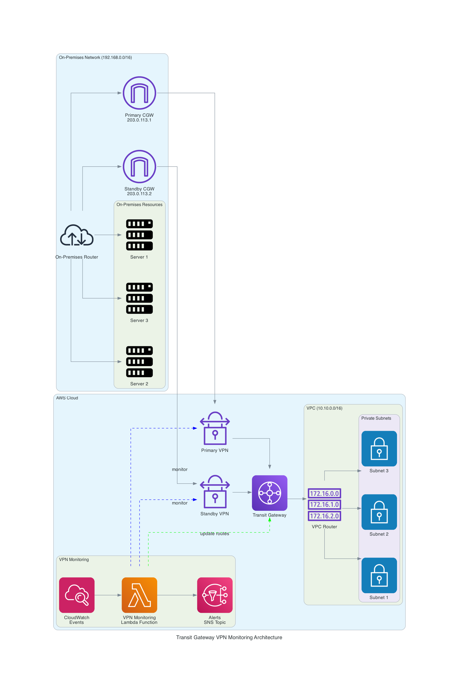

# AWS Transit Gateway Static IPSec VPN Failover Automation

## Overview

This solution provides automated failover between primary and standby Site-to-Site VPN connections attached to an AWS Transit Gateway. It continuously monitors VPN tunnel status and automatically reconfigures routes when failures occur, ensuring high availability for your hybrid network connectivity.



## Key Components

- **AWS Transit Gateway**: Central hub for network traffic between VPC and on-premises networks
- **Site-to-Site VPN Connections**: Primary and standby connections to on-premises network
- **Lambda Function**: Monitors VPN status and updates routes automatically
- **CloudWatch Events**: Triggers the Lambda function on schedule and on AWS Health events
- **SNS Topic**: Sends notifications when route changes occur

## Features

- Automatic detection of VPN tunnel failures
- Seamless failover to standby VPN connection
- Automatic recovery when primary connection is restored
- Real-time notifications of route changes
- Deployment options via CloudFormation or AWS CDK

## Deployment Options

### Option 1: CloudFormation (Recommended)

1. **Prerequisites**:
   - AWS CLI installed and configured
   - A VPC in your AWS account
   - Two public IP addresses for your customer gateways (on-premises VPN devices)

2. **Deploy using script**:
   ```bash
   ./deploy-tgw-vpn-fixed.sh
   ```
   The script will:
   - Show available VPCs in your account
   - Prompt for VPC ID and customer gateway IP addresses
   - Deploy the CloudFormation stack
   - Display stack outputs when complete

3. **Manual deployment**:
   - Open AWS CloudFormation console
   - Create new stack with `tgw-vpn-simplified-fixed.yaml`
   - Enter required parameters
   - Create stack

### Option 2: AWS CDK

1. **Prerequisites**:
   - Node.js and npm installed
   - AWS CDK installed (`npm install -g aws-cdk`)
   - Python 3.9+ installed

2. **Deploy using CDK**:
   ```bash
   cd tgw-vpn-cdk
   pip install -r requirements.txt
   # Update cdk.json with your VPC ID and customer gateway IPs
   cdk deploy
   ```

## Post-Deployment Steps

1. Configure your on-premises VPN devices using the configuration from the AWS Console
2. Verify VPN connections are established
3. Subscribe to the SNS topic for notifications
4. Test failover by shutting down your primary VPN device

## Parameters

- `VpcId`: VPC to attach to the Transit Gateway
- `PrimaryCustomerGatewayIp`: IP address of primary on-premises VPN device
- `StandbyCustomerGatewayIp`: IP address of standby on-premises VPN device
- `OnPremiseCidr`: CIDR block for on-premises network (default: 192.168.0.0/16)
- `LambdaSchedule`: Schedule for Lambda execution (default: rate(5 minutes))

## Architecture Details

The Lambda function monitors both VPN connections and performs the following actions:

1. If primary VPN is healthy, routes traffic through it
2. If primary VPN fails, switches traffic to standby VPN
3. When primary VPN recovers, switches traffic back to primary VPN
4. Sends notifications about all route changes

## Security Considerations

- Lambda function uses least-privilege IAM permissions
- All resources are deployed within your AWS account
- No external dependencies or third-party services required

## Troubleshooting

- Check CloudWatch Logs for Lambda function execution logs
- Verify VPN tunnel status in the AWS Console
- Ensure on-premises VPN devices are properly configured
- Check SNS topic for notification delivery issues

## License

This solution is licensed under the MIT License. See the LICENSE file for details.
